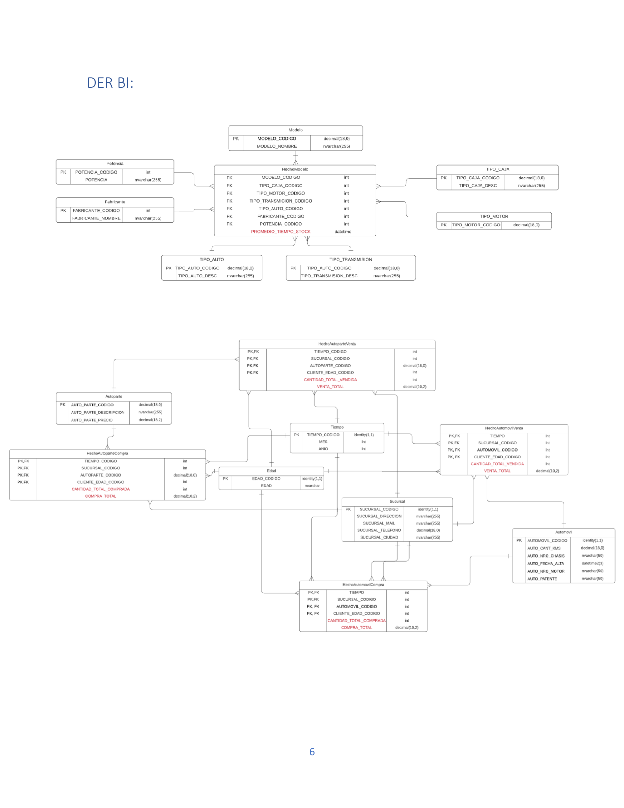

[Back to main README](README.md)

## Strategy

## Data Base: ERD

Firstly, we had to create a normalized ERD with the master table. For this, we distributed the fields of the master table into different entities. Each of these entities should have a primary key, which, in some cases, but not all, was already present in the master table. For entities without a primary key, we created an identity(1,1) primary key to make it auto-incrementable and avoid the repetition of two primary keys in case of data repetition due to error or coincidence. These fields are indicated in red in the ERD to indicate the attributes that were added and were not previously in the master table.

On the other hand, several fields were created to assist in the implementation of the relational database. For example, "product type" in "invoice" and "purchase type" in "purchase" contain the type of product being bought or sold, whether it is a car or auto part, to differentiate what is being sold later on. In the "invoice" and "purchase" entities, a "total price" field was added, which is used to facilitate the calculation of income from auto parts, making it easier to calculate for multiple auto parts in the same purchase, whether they are different or the same.

Finally, we created relationships between the different entities. Due to this, new entities had to be created to facilitate relationships and many-to-many relationships. For example, "PurchaseByAutoPart" and "PurchaseByCar," as well as the "CarItem" and "AutoPartItem" tables were created.

## Data Base: Implementation

For the Database, we first created the tables represented previously in the ERD, specifying data types (maintaining the same types as in the master table) and specifying constraints when necessary. We then implemented the relationships in the database using PRIMARY KEYS and FOREIGN KEYS. We decided to implement the foreign keys outside the table creation using ALTER TABLE, as it improves readability and provides greater clarity. The entire migration was done using stored procedures so that in case of an error, the transactions would not be carried out to maintain data consistency.

## Business Intelligence

For the BI, we performed a migration from the previously created database. In this stage, we designed dimensions based on the established tables in the transactional model, creating new tables (dimensions) without foreign keys in order to implement the fact tables, where these tables would be intersected (with the intersection being the composite key of the fact tables). Additionally, in these fact tables, we added precalculated fields useful for our business model, such as the quantity and total sold/purchased of auto parts/cars per branch and per month, among others, which led to the implementation of the required views in our model.

**Dimensions:** Model – GearType – EngineType – Power – Manufacturer – CarType – TransmissionType

- Branch – Time – Age – AutoPart

**Facts:** ModelFact – CarPurchaseFact – CarSaleFact – AutoPartSaleFact

- AutoPartPurchaseFact

We migrated the data to the aforementioned tables and implemented the BI using views to access the requested information in the task.